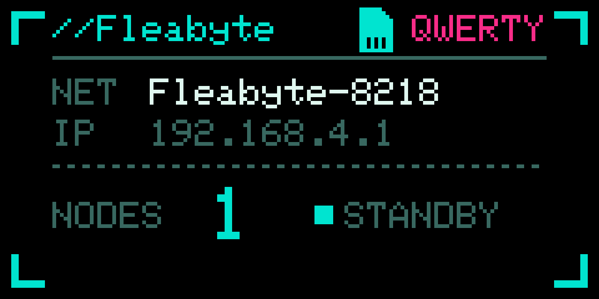
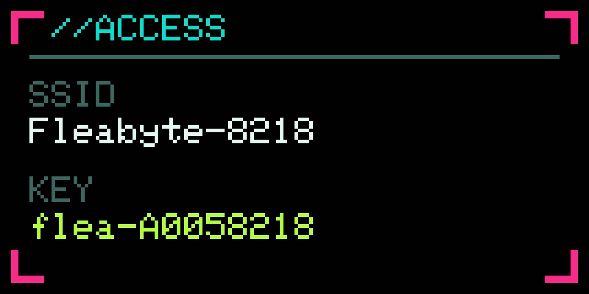
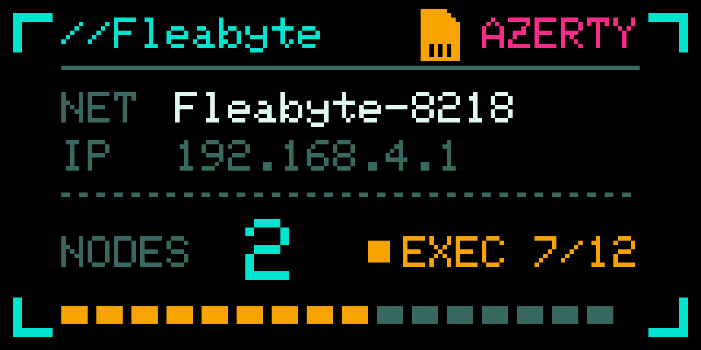

# Fleabyte

Modern BadUSB firmware for the LilyGO T-Dongle S3. Self-hosted web UI,
twelve keyboard layouts, fully offline.



Plug it in and the dongle brings up its own Wi-Fi network. Scan the code on
its screen to join, open the page, pick the keyboard layout of the machine
it is plugged into, and run a script. Nothing leaves the device and nothing
needs installing.

## What it does

* Keystroke scripting with a DuckyScript subset, from a web editor
* Twelve keyboard layouts, switchable at runtime and mid-script
* Payload library stored on the dongle, editable from the browser
* Wi-Fi join code on the screen, so a phone connects without typing a key
* Cancellable countdown before a payload starts
* Host detection, so a payload can wait for the machine instead of guessing
* microSD exposed to the host as a removable drive, with a file browser
* Status screen with run progress, and a configurable RGB LED

| | |
|---|---|
|  |  |
| Waiting for the first connection | Running a payload |

## Scope of use

Machines you own, or for which you hold written authorisation. This is a
keystroke injection tool: it types into whatever it is plugged into.

Execution is always triggered from the web interface. Nothing runs on
plug-in, and the button on the dongle never starts a payload.

## Hardware

A LilyGO T-Dongle S3 and nothing else. A microSD card is optional, and only
used by the USB drive feature.

* [LilyGO store](https://lilygo.cc/products/t-dongle-s3)
* [Amazon](https://www.amazon.fr/dp/B0BK9162QY)
* [Alibaba](https://www.alibaba.com/pla/LILYGO-T-Dongle-S3-ESP32-S3-Development-Board-096_1601590830049.html)

It has to be the **S3**. LilyGO also sells a T-Dongle C5, and the ESP32-C5
has no USB OTG controller: it can only present a serial port, never a
keyboard. The same goes for the C3, C6 and H2. Among the parts LilyGO uses,
only the S2, S3 and P4 can do this at all.

## Installing

**[Flash it from your browser](https://b3rt1ng.github.io/FleaByte/)**, in
Chrome or Edge on a desktop. Nothing to install: hold the button while
plugging the dongle in, click Install, pick the serial port.

Or take the image from a [release](../../releases) and write it yourself:

```sh
esptool --chip esp32s3 --port /dev/ttyACM0 write-flash 0x0 firmware.bin
```

Either way the image stops before the filesystem partition, so an update
keeps saved payloads and settings.

## Documentation

* [DOCS.md](DOCS.md) covers building from source, the script commands, the
  settings and the USB drive
* [NOTES.md](NOTES.md) collects the hardware quirks worth knowing before
  changing anything

## Credits

Pin assignments and panel initialisation values come from
[LilyGO's T-Dongle S3 examples](https://github.com/Xinyuan-LilyGO/T-Dongle-S3)
(MIT). The display is driven through
[Adafruit GFX](https://github.com/adafruit/Adafruit-GFX-Library) and
[Adafruit ST7735](https://github.com/adafruit/Adafruit-ST7735-Library)
(BSD). Keyboard layout tables and the QR encoder ship with the
[ESP32 Arduino core](https://github.com/espressif/arduino-esp32).

## License

MIT, see [LICENSE](LICENSE).
